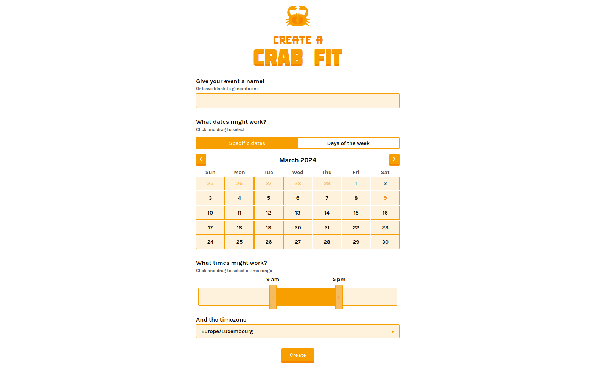

<!--
Важно: этот README был автоматически сгенерирован <https://github.com/YunoHost/apps/tree/master/tools/readme_generator>
Он НЕ ДОЛЖЕН редактироваться вручную.
-->

# Crab Fit для YunoHost

[](https://ci-apps.yunohost.org/ci/apps/crabfit/)  

[](https://install-app.yunohost.org/?app=crabfit)

*[Прочтите этот README на других языках.](./ALL_README.md)*

> *Этот пакет позволяет Вам установить Crab Fit быстро и просто на YunoHost-сервер.*  
> *Если у Вас нет YunoHost, пожалуйста, посмотрите [инструкцию](https://yunohost.org/install), чтобы узнать, как установить его.*

## Обзор

Crab Fit helps you fit your event around everyone's schedules.
Simply create an event above and send the link to everyone that is participating.
Results update live and you will be able to see a heat-map of when everyone is free.

## Features

- Click and slide to select multiple time slots at once.
- Editable using a one-time password


**Поставляемая версия:** 1.0~ynh4

**Демо-версия:** <https://crab.fit>

## Снимки экрана



## Документация и ресурсы

- Официальный веб-сайт приложения: <https://crab.fit>
- Официальная документация пользователя: <https://github.com/GRA0007/crab.fit>
- Официальная документация администратора: <https://github.com/GRA0007/crab.fit>
- Репозиторий кода главной ветки приложения: <https://github.com/GRA0007/crab.fit>
- Магазин YunoHost: <https://apps.yunohost.org/app/crabfit>
- Сообщите об ошибке: <https://github.com/YunoHost-Apps/crabfit_ynh/issues>

## Информация для разработчиков

Пришлите Ваш запрос на слияние в [ветку `testing`](https://github.com/YunoHost-Apps/crabfit_ynh/tree/testing).

Чтобы попробовать ветку `testing`, пожалуйста, сделайте что-то вроде этого:

```bash
sudo yunohost app install https://github.com/YunoHost-Apps/crabfit_ynh/tree/testing --debug
или
sudo yunohost app upgrade crabfit -u https://github.com/YunoHost-Apps/crabfit_ynh/tree/testing --debug
```

**Больше информации о пакетировании приложений:** <https://yunohost.org/packaging_apps>
